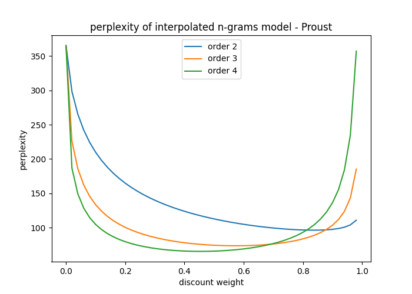

# Language Models

<p align="center">
    
<p/>

I build and evaluate two word-level language models:
an **n-gram language model** and a **neural language model**.

The models are trained on the novel *A la recherche du temps perdu* by Marcel Proust.
The files are available in the [`data`](data/proust/) folder and have been (freely) downloaded
from [Project Gutemberg](https://www.gutenberg.org/).

To build the models, I assume that the sentences are independent,
hence I only consider dependence between words that are in the same sentence.

The corpus is composed of 26350 sentences and 1147901 words in total.
I keep 80% of these sentences to train the models,
10% to validate them and another 10% to test them.
The vocabulary is composed of the words and the punctuation signs that appear at least
five times in the training sentences (the other tokens being replaced by the token `<oov>`).
The size of the vocabulary is 9154. 

## N-gram language model

I build bigram, trigram and 4-gram language models.
To smooth the models, I use a simple recursive interpolation with a fixed weight `lambda`,
following the formula
```
LM(N) = lambda * N-gram(N) + (1-lambda) * LM(N-1)
```
where LM(N) is the smoothed language model of order N and N-gram(N) is the n-gram model
(also of order N).
LM(1) is set to be a unigram language model.

To choose the order and the weight, I perform a grid-search and report on the following image
the perplexity of each model on the validation set.

<p align="center">
    
<p/>

The best model is obtained with the order 4 and the weight 0.46.
The perplexity on the test set is then __60.97__.

Below are sentences generated by this model:

> ce soir, après le, : « vous \<oov\> à \<oov\> pour, je ne fis pas ce qu même peu depuis dont (avais de ma chambre, il briller'ayant commencé que et de l'aristocratie qui s'de peine comprendre certaines choses à'œuvre dont on n'eût plus sur a en amour.
>
> ce soir, et qu.
>
> ce soir que pour encore longtemps vous verrez, continua mme de guermantes, de laquelle diabolique la fussent dit-il d'un bonheur possible et que à entrer dans une fleur un insecte \<oov\> et s'en étaient, eut avait point \<oov\> d'une \<oov\> trop qui -- pareilles à l'opéra, éprouver s'il semblait qu \<oov\> d'avoir pas tort sur un point de qu'il n au contraire, elle n'aurait pu en \<oov\> de \<oov\> corps les tiges des'l'où il dans tasse destinés à, ne prononça pas le \<oov\> » de maître un \<oov\> aussi une individualité particulière pour un \<oov\> de l'autre que ne l'entraîner à toute vitesse, je ne serai pas un médecin.
>
> ce soir; de pendant \<oov\> à \<oov\> ce jour-là que mlle commençant cent être'où les obstacles et les yeux d'albertine, , et une \<oov\> à aller voyez, vous me direz votre bergotte, eut effort de se servir du téléphone.
>
> ce soir ou du grand salon qui avait elle-même l'a compris de lui-même et ramenait'rêve.

## Neural language model

I build a simple language model with an LSTM network composed of two recurrent layers,
an initial embedding layer and a final dense layer.

The tokens are embedded in a space of dimension 128 and the model is designed to make predictions
based on a sequence of maximum 30 tokens.

The perplexity of the model on the test set is __54.18__. 

Below are sentences generated by the model:

> ce soir brichot, me trouvait de voir chez eux les jours après la duchesse des reproches.
> 
> ce soir, tout aussi bien que swann finit le professeur du milieu de m. de guermantes, qui imitait le château, il \<oov\> le roi, elle avait accordé « je suis très bien » et d'entendre ce dont l'on n'entend jamais les \<oov\> \<oov\> (je \<oov\> vainement à françoise parler avec ses pêcheurs si vives.
> 
> ce soir, je ne \<oov\> jamais à ce temps chez elle et que je regrette, , presque plus réaliste du docteur, si bien que ma respiration ne me levait, je n'avais pas éprouvé au buffet de combray albertine était bien, je le sais bien que je lui \<oov\> de moins complètement, je me rappelai tout de suite combien ma malle voix fixa.
> 
> ce soir non plus de confiance parce que notre imagination était aveugle dans la vérité, le fils fondé à l'endroit un \<oov\> \<oov\>, car aimé était intimidé sous sa poussière d'état près de maman et confuse du souverain jusqu'à avoir personnellement pour m'en supporter comme moi, dans ce cas tête, comme une pareille faculté de sortie dans ce temps-là, trois vraie douce à qui en sortant d'elstir ne sait nullement par lui, en formant une \<oov\>.
> 
> ce soir, ignorant peu d'offenser, la grande-duchesse attendre l'indifférence du prince de borodino par paris, elle me \<oov\> joyeusement comme si dans ses deux un nez \<oov\>, dans cette direction jaune de la salle, morel m'arriva.

## How to reproduce the results

For each model category there is, in the `src` folder, a `*_train.py` script (to train and
validate the model) and a `*_eval.py` script (to test the model).
The latter script loads the appropriate model generated by the former script and
saved in `data/models`.

To run these scripts, set up a python virtual environment with pytorch (the scripts have been
tested with Python 3.8 and Pytorch 1.7 but lower versions should also be okay).
Then, install the required packages:
```
python -m pip install -U -r requirements.txt
```
